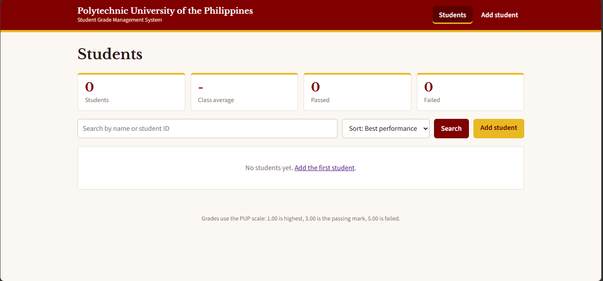
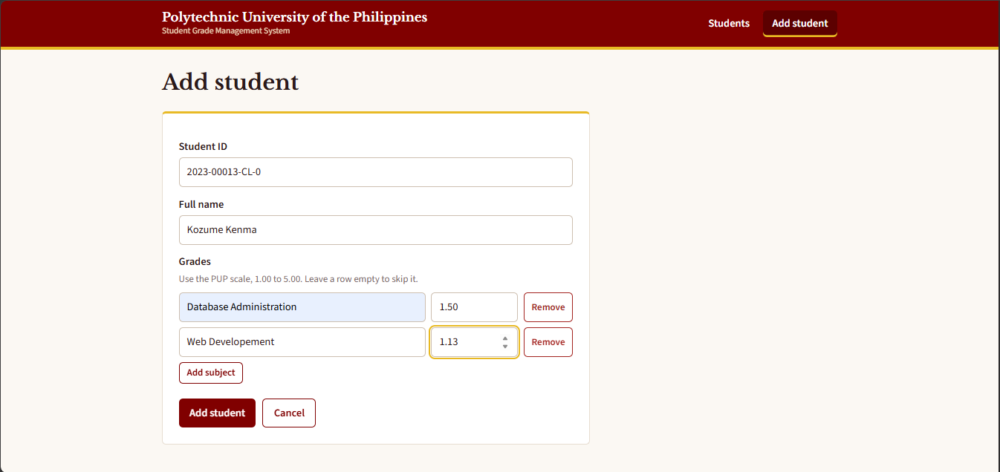
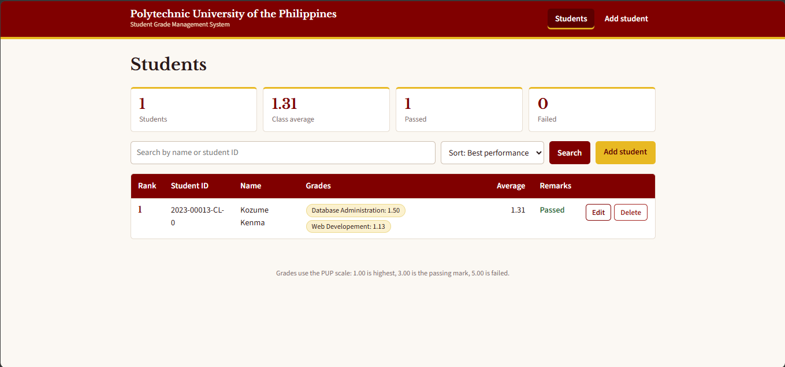

# Student Grade Management System

A simple web app for managing student grades, built with Python and Flask. It calculates averages, ranks students, and lets you search records quickly. The design uses the PUP colors (maroon and gold).


## Screenshots

**Home (no students yet)**



**Add student**



**Students list with average, rank, and remarks**



## Features

- Add student records and grades
- Search for a student by name or ID
- Edit or delete students and grades
- Calculate and display average grades
- Sort students by performance, name, or ID
- Menu-based navigation

## Requirements

- Python 3.8 or newer
- Flask (`pip install flask`)
- A web browser

## How to Run

1. Put `app.py` in a folder.
2. Open a terminal in that folder.
3. Install Flask:
   ```
   pip install flask
   ```
4. Run the app:
   ```
   python app.py
   ```
5. Open your browser and go to http://127.0.0.1:5000

To stop the app, press `Ctrl + C` in the terminal.

## How to Use

1. Click **Add student**, enter the Student ID and full name, then add subjects and grades.
2. Go to **Students** to see everyone, ranked by average.
3. Use the search box to find a student by name or ID.
4. Use the sort menu to switch between best performance, name, or ID.
5. Click **Edit** to change a name or grades, or **Delete** to remove a student.

## Grading Scale

The system uses the PUP grading scale:

| Grade | Meaning |
|-------|---------|
| 1.00 | Highest |
| 3.00 | Passing mark |
| 5.00 | Failed |

A student with an average of 3.00 or better is marked **Passed**. Anything higher is marked **Failed**. Students with the same average share the same rank.

## Data Storage

Records are saved automatically in `students.json`, created in the same folder as `app.py`. Delete this file to reset all data.

## Project Files

```
grade-system/
├── app.py            # Flask app (logic, routes, and UI)
├── students.json     # Saved records (created automatically)
├── README.md
└── screenshots/
```

## Tech Used

- Python 3
- Flask
- HTML and CSS (served through Flask templates)
- JSON file storage